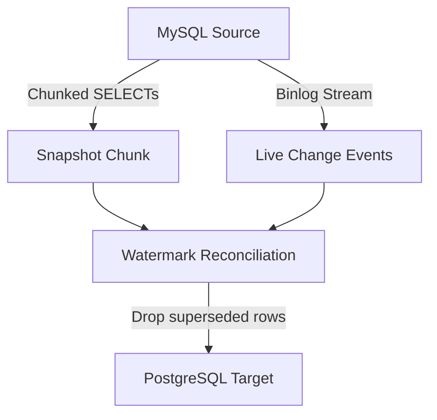
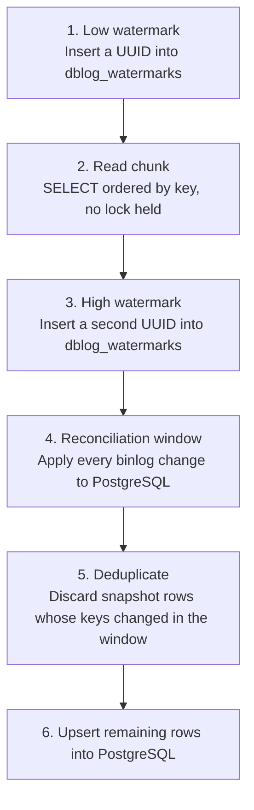

# DB-RAIDr

**DB-RAIDr** is a lock-free, zero-downtime MySQL-to-PostgreSQL migration and Change Data Capture (CDC) tool written in C# (.NET 8).

It implements the [DBLog watermark algorithm](https://arxiv.org/abs/2010.12597) so large tables can be snapshot-backfilled while the live binlog is still being applied—without global read locks, table locks, or a long-lived snapshot transaction.

---

## Key Features

- **Lock-Free Chunked Backfill:** Backfills tables chunk-by-chunk using cursor pagination on primary or unique keys.
- **DBLog Watermarking:** Inserts low and high watermark markers into a helper table in MySQL to reconcile snapshot rows against in-flight transactions.
- **Continuous CDC (Phase 2):** Transitions from historical backfill to real-time binlog streaming.
- **Idempotent Delivery:** PostgreSQL targets receive idempotent writes (`INSERT ... ON CONFLICT DO UPDATE` and key-based `DELETE`), so crash recovery and restarts are safe.
- **Composite Key & Binary Key Support:** Multi-column composite keys and mixed types (binary/UUIDs, JSON, BIT, SET, ENUM, DECIMAL).
- **Graceful Pausing & Resumption:** `Ctrl-C` finishes the current chunk and saves progress to disk. The state file lets a later run resume instead of starting over.
- **Secure Configuration:** Database passwords come from environment variables or `.env` files, never from `config.json`.

---

## How It Works

DB-RAIDr runs in two phases:



### The Watermark Algorithm (Phase 1: Backfill)



Change events between the two watermarks identify rows that changed during the `SELECT`. Those snapshot rows are dropped because the already-applied binlog event is newer.

### Continuous CDC (Phase 2: Follow)

Once every table finishes Phase 1, DB-RAIDr streams live `INSERT`, `UPDATE`, and `DELETE` events from the MySQL binlog into PostgreSQL until you stop it.

---

## Prerequisites

### 1. .NET SDK

DB-RAIDr targets **.NET 8**. Install the [SDK](https://dotnet.microsoft.com/download/dotnet/8.0), then restore packages (they are declared in `DbRaidr.csproj`):

```bash
dotnet restore
```

| Package | Role |
|---|---|
| `MySqlCdc` | MySQL binlog replication stream |
| `MySqlConnector` | Ordinary MySQL queries |
| `Npgsql` | PostgreSQL client |

### 2. MySQL Server Configuration

The source instance must have binary logging with full row images and metadata. In `my.cnf` / `mysqld.cnf`:

```ini
[mysqld]
binlog_format            = ROW
binlog_row_image         = FULL
binlog_row_metadata      = FULL        # Required for MySQL 8.0.14+
binlog_row_value_options = ""          # Must NOT be PARTIAL_JSON
```

Verify:

```sql
SELECT @@GLOBAL.binlog_format,
       @@GLOBAL.binlog_row_image,
       @@GLOBAL.binlog_row_metadata,
       @@GLOBAL.binlog_row_value_options;
```

### 3. Watermark Table

Create a small InnoDB table for low and high watermarks. **It must live in the same database as the tables being migrated**, or its rows never reach the stream:

```sql
CREATE TABLE dblog_watermarks (
    id VARCHAR(64) PRIMARY KEY
) ENGINE=InnoDB;
```

### 4. Table Schema Requirements

- **Primary / Unique Keys:** Every table in the migration list must have `key_columns` configured. Those columns must be `NOT NULL` in MySQL and must have a matching unique or primary key on both MySQL and PostgreSQL.
- **Target Tables:** PostgreSQL tables must already exist with the desired schemas and indexes before backfill starts.

---

## Configuration

Each migration uses a workspace directory that holds `config.json` and the persistent state file (`dblog_state.json`).

### Workspace Layout

```
my-migration/
├── .env                  # Optional: database passwords
├── config.json           # Migration settings and table mappings
└── dblog_state.json      # Auto-generated runtime state
```

### Environment Variables (`.env`)

Passwords are never placed in `config.json`. Set the variables named in each database's `password_env` field:

```env
SHOP_MYSQL_PW="source_secret_password"
SHOP_PG_PW="target_secret_password"
```

The program walks upward from the current directory to find a `.env` and does not overwrite variables already set in the environment.

### `config.json` Reference

```json
{
  "mysql": {
    "host": "127.0.0.1",
    "port": 3306,
    "user": "repl",
    "db": "shop",
    "password_env": "SHOP_MYSQL_PW"
  },
  "postgres": {
    "host": "127.0.0.1",
    "port": 5432,
    "user": "repl",
    "db": "shop",
    "password_env": "SHOP_PG_PW"
  },
  "chunk_size": 1000,
  "server_id": 100,
  "watermark_table": "dblog_watermarks",
  "watermark_timeout_seconds": 120,
  "heartbeat_seconds": 10,
  "state_file": "dblog_state.json",
  "tables": [
    {
      "mysql_table": "users",
      "pg_table": "public.users",
      "key_columns": ["id"]
    },
    {
      "mysql_table": "documents",
      "pg_table": "public.documents",
      "key_columns": ["tenant_id", "content_sha256"],
      "skip_columns": ["search_vector"]
    }
  ]
}
```

#### Configuration Options

| Field | Type | Default | Description |
|---|---|---|---|
| `mysql` | `object` | *required* | Source connection (`host`, `port`, `user`, `db`, `password_env`). |
| `postgres` | `object` | *required* | Target connection (`host`, `port`, `user`, `db`, `password_env`). |
| `chunk_size` | `integer` | `1000` | Rows per snapshot `SELECT` chunk. |
| `server_id` | `integer` | `100` | Unique replica ID presented by the binlog client to MySQL. |
| `watermark_table` | `string` | `"dblog_watermarks"` | Watermark table name in the MySQL schema. |
| `watermark_timeout_seconds` | `number` | `120` | Max seconds of binlog inactivity before a chunk window times out. |
| `heartbeat_seconds` | `number` | `10` | Binlog client heartbeat interval on an idle server. |
| `state_file` | `string` | `"dblog_state.json"` | Checkpoint file name inside the workspace directory. |
| `tables` | `array` | *required* | Table mapping definitions (see below). |

#### Table Mapping Fields

- `mysql_table`: Source table name in MySQL.
- `pg_table`: Fully-qualified PostgreSQL table name (for example `"public.users"`).
- `key_columns`: Primary or unique key columns. Used for chunk ordering and `ON CONFLICT`.
- `skip_columns`: *(Optional)* Columns to omit from the copy (generated columns, search vectors, and similar).

---

## Usage

Point the program at the workspace folder:

```bash
dotnet run --project DbRaidr.csproj -- ./my-migration
```

Or after `dotnet build`:

```bash
dotnet bin/Debug/net8.0/DbRaidr.dll ./my-migration
```

### Lifecycle and Controls

- **Starting Fresh:** With no state file, DB-RAIDr records the current binlog position, backfills each table in `config.json` order, then enters continuous replication.
- **Graceful Shutdown (`Ctrl-C` once):** Finishes the current chunk or transaction, commits PostgreSQL, flushes the state file atomically, and exits.
- **Force Exit (`Ctrl-C` twice):** Cancels the blocking stream immediately. Saved state may lag slightly; later runs self-heal because writes are idempotent.
- **Resuming:** Run the same command with the same workspace. DB-RAIDr loads `dblog_state.json` and continues from the last checkpoint.

---

## Type Conversions & Handling

Column kinds are discovered from MySQL `information_schema` at startup:

| MySQL Type | Handling & PostgreSQL Mapping |
|---|---|
| `BINARY`, `VARBINARY`, `*BLOB` | Raw bytes mapped to PostgreSQL `BYTEA`. Binary keys are hex-encoded for identity. |
| `BIT` | Normalized to an integer on both snapshot reads and binlog events. |
| `JSON` | Canonical JSON text, cast to PostgreSQL `jsonb`. |
| `SET` | Decoded and sorted so snapshot and binlog routes agree. |
| `ENUM` | Binlog numeric index converted back to the label. |
| `DECIMAL` | Preserved as text and cast to PostgreSQL `numeric`. |
| `TIME` | Formatted as a days / `h:mm:ss` string. |
| Key Updates | An `UPDATE` that changes key columns issues `DELETE` of the old key, then upserts the new row. |

---

## Limitations & Best Practices

1. **DDL Handling:** Source DDL (`CREATE`, `ALTER`, `DROP`, `TRUNCATE`, `RENAME`) is not replayed. The process stops with an error. Apply schema changes on both engines yourself.
2. **Key Mutability:** Do not change `key_columns` in `config.json` after a backfill has started. If keys change, delete `dblog_state.json` and restart.
3. **Binlog Retention:** Keep MySQL binary logs long enough to cover planned downtime or a slow backfill.
4. **Unique Indexes:** `NOT NULL` on key columns is checked at startup. A unique index on those columns is not checked, but without it rows can merge and pagination can skip rows.
